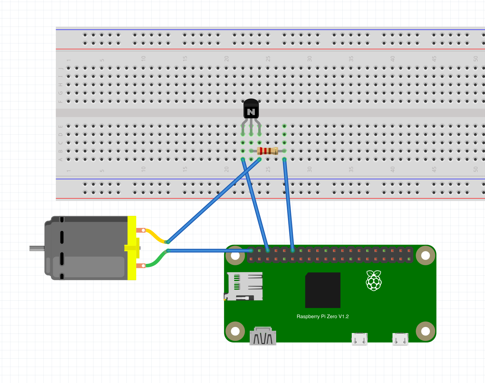

# Pi Fan Control
This is a fan control solution for the Raspberry Pi which uses a 5v CPU cooing fan, connected to the Raspberry Pi, through an NPN transistor, to a PWM pin. The script ramps up the fan speed gradually, proportional to the temperature of the Pi CPU. I felt the need to make this because my fan, on its max speed, makes a lot of noise and I found that in most cases, you don't even need the fan on, let alone run it on slow speeds. It is only when the Pi is overclocked and running under some heavy load, that you need to ramp up the fans. Having a variable speed fan control script like this is very handy in an overclocked setup (In my case, a Raspberry Pi 4B overclocked to 2GHz). Also, the fan makes significantly less noise when it is not running at full throttle.

### Fan Wiring
<br>
In my setup I used pin 12 but you may use any pin and modify the pin number in the script accordingly. This is my wiring setup for the fan:
<br>

<br>
The transistor is a 2N2222 NPN transistor and the resistor is a 600 Ohm resistor. The fan is a standard 5V cooling fan.
<br>
There are two python scripts present here, `fan_control_script` and `fanctl`. The `fan_control_script` script is responsible for controlling the fan and the `fanctl` script is used to toggle the fan on or off and to query the fan for information such as fan speed. These scripts have been tested on a fresh install of Raspberry Pi OS. Feel free to modify the scripts as per your convenience.
<br>
<br>
## Installation
You need python3 and git installed on your system (Installed by default on the desktop version of Raspberry Pi OS).
<br>
```
git clone https://github.com/aniansh19019/pi_fan_control
cd pi_fan_control
sudo chmod +x install.sh
./install.sh
```
<br>
<br>
## Usage
After running the `install.sh` script, the files `fan_control_script` and `fanctl` will be moved to your `/usr/bin` folder and a systemd service is created which makes sure that the fan control script runs on system boot. You can modify the thresholds in the `fan_control_script` file if you feel.
<br>
Now, to view the status of the fan (fan speed, CPU temperature), use the following command:
```
fanctl status
```
or just
```
fanctl
```
<br>
To toggle the fan on or off:
```
fanctl toggle
```
<br>
